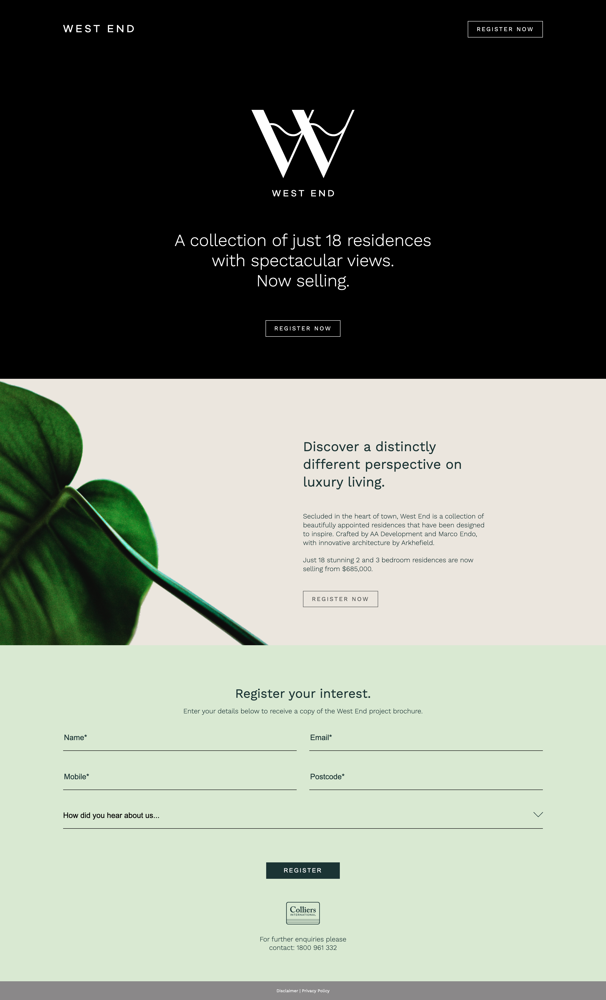

# Chriate - Frontend Test

This is my solution to the front end test by Chriate. This document includes my thought process throughout the test and some challenges I faced.

## Table of contents

- [Screenshots](#screenshots)
- [Process](#process)
- [Challenges](#challenges)

## Screenshots

### Desktop (1440px width)

### Mobile (375px width)

## Process

1. I setup my development environment/workflow before diving into the code. I installed NPM (package manager) to enable hot module reloading (live-server), SCSS with transpilation in real time (via npm script) and a simple script that gets everything running at once (using concurrently).

2. I then studied the design file to see if there was an underlying design system being used (ie. 4px or 8px divisible units or common container sizes). I could not find a clear pattern in the style, so I defaulted to the units within the file (rounded up where it made sense) and the container styling offered within Bootstrap.

3. At this point, I tested all the layout styles that I had committed to. I mocked up low fidelity sections to test for responsiveness.

4. From here, I started coding each section, one by one, from top to bottom. I tried to organise the html for readability, and chose to limit nesting styles within the SCSS file to lessen complexity.

5. Assets were downloaded from the design file and used where appropriate. I chose to use images instead of text within anchor and button tags when I could not extract font information. My concern with this approach (on a real project) is that it increases the download commitment for clients who request the page. Ideally, I would reduce the number of assets used.

## Challenges

- Using Bootstrap was a challenge because it overwrote the default styling that I was expecting to use. I reduced the impact of Bootstrap by only downloading the files for it's grid system and overwrote the imported container styles to achieve expected behaviour.

- Using Abode XD was a challenge because I had not used it prior to this test. Extracting assets and getting relational information (distance between elements) was challenging at certain points due to how components were grouped. I found XD intuitive to use near the end of the test, and can see it's advantages over other commonly used software.
